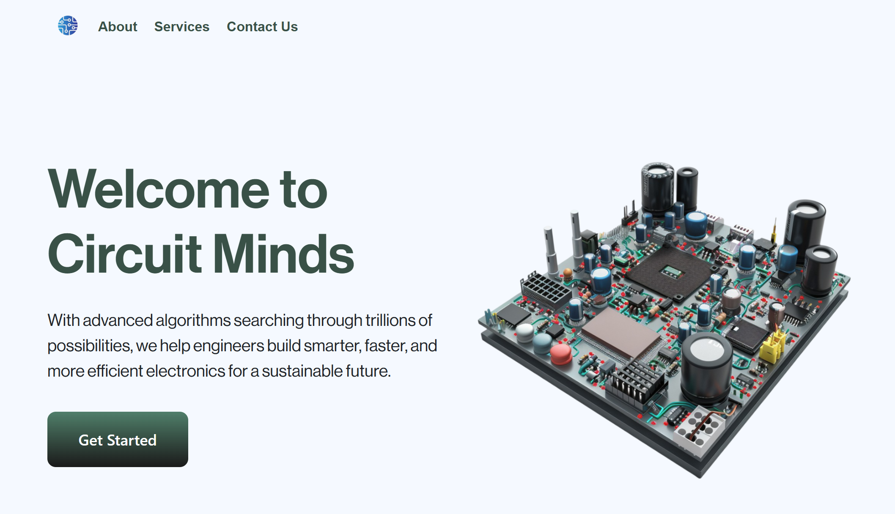

# Circuit Minds 

  	  

This is a simple landing page designed for a fictional engineering company called **Circuit Minds**. I've built this as a practice project using HTML, CSS, and JavaScript, with Mailchimp for email subscriptions and Netlify for deployment.

You can also explore:

- [Live Demo](https://circuitminds.netlify.app/) 

Screenshot:

 

